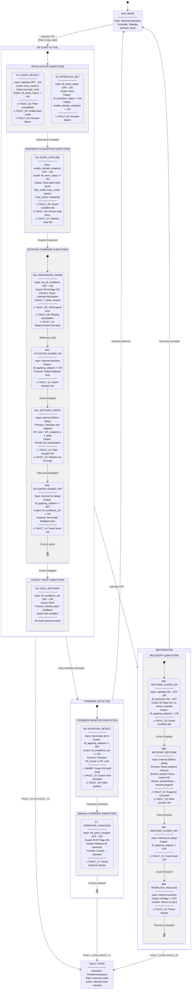

```mermaid
stateDiagram-v2
    [*] --> IDLE

    state "IDLE MODE<br/>───────────<br/>Plant: Nominal Operation<br/>Controller: Standby<br/>Interlock: None" as IDLE

    state "DF EVENT ACTIVE" as DF_ACTIVE {
        state "INITIALIZATION SUBSYSTEM" as INIT_SUB {
            state "S1: EVENT_DETECT<br/>───────────<br/>Input: calendar OFF→ON<br/>Guard: hvac_mode ∈ {heat,cool,heat_cool}<br/>Output: df_event_status := ON<br/>───────────<br/>⚠️ FAULT_01: Plant unavailable<br/>⚠️ FAULT_02: Invalid plant mode<br/>⚠️ FAULT_03: Actuator failure" as S1

            state "S2: INTERLOCK_SET<br/>───────────<br/>Input: df_event_status OFF→ON<br/>Guard: None<br/>Output: df_restriction_status := ON<br/>Output: enable_climate_snapshot := ON<br/>───────────<br/>⚠️ FAULT_04: Actuator failure" as S2
        }

        state "SNAPSHOT ACQUISITION SUBSYSTEM" as SNAP_SUB {
            state "S3: STATE_CAPTURE<br/>───────────<br/>Input: enable_climate_snapshot OFF→ON<br/>Guard: df_event_status == ON<br/>Output: Store plant state vector<br/>[fan_mode, hvac_mode, preset,<br/>hvac_action, setpoints]<br/>───────────<br/>⚠️ FAULT_05: Guard condition fail<br/>⚠️ FAULT_06: Sensor read NULL<br/>⚠️ FAULT_07: Memory write fail" as S3
        }

        state "SETPOINT OVERRIDE SUBSYSTEM" as CTRL_SUB {
            state "S4a: REFERENCE_PARSE<br/>───────────<br/>Input: set_df_conditions OFF→ON<br/>Guard: All init flags ON<br/>Process: Parse calendar.description<br/>Extract: T_delta, season<br/>───────────<br/>⚠️ FAULT_08: JSON parse error<br/>⚠️ FAULT_09: Missing parameters<br/>⚠️ FAULT_10: Season/mode mismatch" as S4a

            state "S4b: ACTUATOR_GUARD_ON<br/>───────────<br/>Input: Internal transition<br/>Output: df_applying_setpoint := ON<br/>Purpose: Inhibit feedback loop<br/>───────────<br/>⚠️ FAULT_11: Guard actuator fail" as S4b

            state "S4c: SETPOINT_WRITE<br/>───────────<br/>Input: Internal (500ms delay)<br/>Process: Calculate new setpoint<br/>SP_new = SP_snapshot ± T_delta<br/>Output: climate.set_temperature<br/>───────────<br/>⚠️ FAULT_12: Plant actuator fail<br/>⚠️ FAULT_13: Setpoint out of range" as S4c

            state "S4d: ACTUATOR_GUARD_OFF<br/>───────────<br/>Input: Internal (3s delay)<br/>Output: df_applying_setpoint := OFF<br/>Output: df_conditions_set := ON<br/>Purpose: Re-enable feedback loop<br/>───────────<br/>⚠️ FAULT_14: Guard stuck ON" as S4d

            [*] --> S4a
            S4a --> S4b: Reference valid
            S4b --> S4c: Guard engaged
            S4c --> S4d: Plant acknowledged
            S4d --> [*]: Control active
        }

        state "STEADY STATE SUBSYSTEM" as STEADY_SUB {
            state "S5: HOLD_SETPOINT<br/>───────────<br/>Input: df_conditions_set OFF→ON<br/>Guard: None<br/>Process: Monitor plant feedback<br/>Await: Exit condition<br/>───────────<br/>No faults (passive state)" as S5
        }

        [*] --> INIT_SUB
        INIT_SUB --> SNAP_SUB: Initialization complete
        SNAP_SUB --> CTRL_SUB: Snapshot acquired
        CTRL_SUB --> STEADY_SUB: Control engaged
    }

    state "OVERRIDE DETECTED" as OVERRIDE {
        state "FEEDBACK MONITOR SUBSYSTEM" as FB_SUB {
            state "S6: DEVIATION_DETECT<br/>───────────<br/>Input: thermostat attr Δ<br/>Guard: df_applying_setpoint == OFF<br/>Guard: df_conditions_set == ON<br/>Process: Compare SP_actual vs SP_cmd<br/>───────────<br/>✓ INHIBIT: Guard ON (self-cmd)<br/>⚠️ FAULT_15: Guard stuck (missed)<br/>⚠️ FAULT_16: False positive" as S6
        }

        state "MANUAL OVERRIDE SUBSYSTEM" as MAN_SUB {
            state "S7: OPERATOR_TAKEOVER<br/>───────────<br/>Input: set_point_changed OFF→ON<br/>Guard: All DF flags ON<br/>Output: Release all interlocks<br/>Transfer: Control → Operator<br/>───────────<br/>⚠️ FAULT_17: Partial interlock release" as S7
        }

        [*] --> FB_SUB
        FB_SUB --> MAN_SUB: Deviation confirmed
        MAN_SUB --> [*]: Control released
    }

    state "RESTORATION" as RESTORE {
        state "RECOVERY SUBSYSTEM" as RECV_SUB {
            state "S8a: RESTORE_GUARD_ON<br/>───────────<br/>Input: calendar ON→OFF OR<br/>df_restriction ON→OFF<br/>Guard: DF flags ON, no device override<br/>Output: df_applying_setpoint := ON<br/>───────────<br/>⚠️ FAULT_18: Guard condition fail" as S8a

            state "S8b: SETPOINT_RESTORE<br/>───────────<br/>Input: Internal (500ms delay)<br/>Process: Read snapshot memory<br/>Branch: preset==temp → restore SP<br/>Branch: preset≠temp → resume program<br/>───────────<br/>⚠️ FAULT_19: Snapshot corrupted<br/>⚠️ FAULT_20: Plant actuator fail" as S8b

            state "S8c: RESTORE_GUARD_OFF<br/>───────────<br/>Input: Internal (2s delay)<br/>Output: df_applying_setpoint := OFF<br/>───────────<br/>⚠️ FAULT_21: Guard stuck ON" as S8c

            state "S8d: INTERLOCK_RELEASE<br/>───────────<br/>Input: Internal transition<br/>Output: All flags := OFF<br/>Transfer: Return to IDLE<br/>───────────<br/>⚠️ FAULT_22: Partial release" as S8d

            [*] --> S8a
            S8a --> S8b: Guard engaged
            S8b --> S8c: Plant restored
            S8c --> S8d: Guard released
            S8d --> [*]: Recovery complete
        }
    }

    state "FAULT STATE<br/>───────────<br/>Interlocks: Partial/Inconsistent<br/>Plant: Unknown state<br/>Action: Manual reset required" as FAULT

    %% Nominal transitions
    IDLE --> DF_ACTIVE: calendar ON<br/>[Plant mode valid]
    DF_ACTIVE --> RESTORE: calendar OFF
    DF_ACTIVE --> OVERRIDE: Plant feedback deviation
    OVERRIDE --> IDLE: Operator takeover
    RESTORE --> IDLE: Recovery complete

    %% Fault transitions
    DF_ACTIVE --> FAULT: FAULT_01 thru FAULT_14
    OVERRIDE --> FAULT: FAULT_15 thru FAULT_17
    RESTORE --> FAULT: FAULT_18 thru FAULT_22
```
