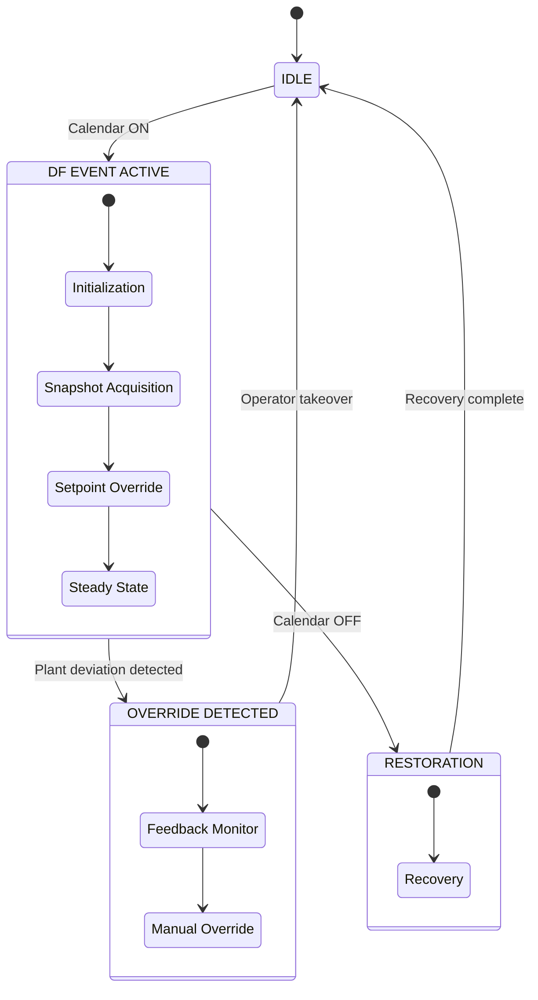
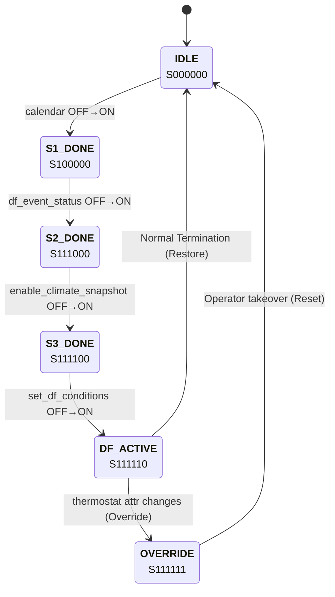
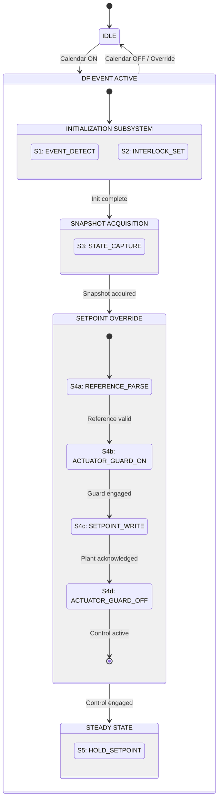

┌─────────────────────────────────────────────────────────────────────┐
│                        SUPERVISORY CONTROLLER                       │
│                      (Home Assistant Automation)                    │
├─────────────────────────────────────────────────────────────────────┤
│  REFERENCE INPUT          CONTROLLER              PLANT OUTPUT      │
│  ┌─────────────┐         ┌─────────┐            ┌─────────────┐     │
│  │  Calendar   │─────────│  State  │────────────│ Thermostat  │     │
│  │  (T_delta,  │  r(t)   │ Machine │   u(t)     │   (HVAC)    │     │
│  │   season)   │         │         │            │             │     │
│  └─────────────┘         └────┬────┘            └──────┬──────┘     │
│                               │                        │            │
│                               │    ┌──────────┐        │            │
│                               │    │ FEEDBACK │        │ y(t)       │
│                               └────│  MONITOR │◄────── ┘            │
│                                    │ (Override│                     │
│                                    │  Detect) │                     │
│                                    └──────────┘                     │
│  INTERLOCK FLAGS (State Memory):                                    │
│  [df_event_status, df_restriction_status, enable_climate_snapshot,  │
│   set_df_conditions, df_conditions_set, df_applying_setpoint,       │
│   set_point_changed_on_device]                                      │
└─────────────────────────────────────────────────────────────────────┘

