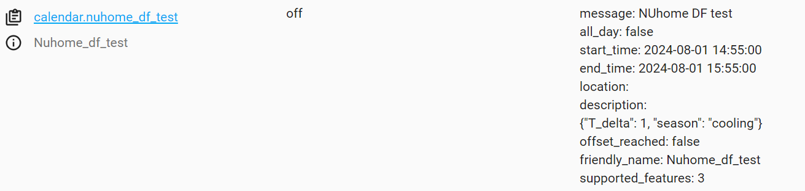

# The MA 01 house DF test automation uses the following entities

## Entities

### Calendar
- Using the Google calendar events to manage the start and end time of the DF events. This calendar entity is generarted from [google calendar HA integration](https://www.home-assistant.io/integrations/google/). The integration allows read and write events for a calendar attached with the google acct the HA server is authorized to access. 

Follow the google calendar integration documentation to set up the integration.

#### For DF event specific directions: 
    - only eable the calendar entity you want to use for the DF event, disable the rest. 
    - the google calendar event should have a description in a JSON string format with keys - t_delta and season for the DF automation to set appropriate offsets. 


 - calendar.df_weh
    
#### Google caledar example DF event  

#### Google caledar example HA entity



### Climate
- climate.thermostat
- climate.thermostat_snapshot

as of 7/31: 
this is automaation/blueprint is set up to be for just one thermostat poer house. The snapshot climate entity uses the HACS integration [climate-template](https://github.com/jcwillox/hass-template-climate)


### Input Texts
- input_boolean.set_df_conditions
- input_text.thermostat_snapshot_fan_mode
- input_text.thermostat_snapshot_hvac_mode
- input_text.thermostat_snapshot_preset_mode
- input_text.thermostat_snapshot_hvac_action
- input_text.thermostat_snapshot_target_temp_low
- input_text.thermostat_snapshot_target_temp_high
- input_text.thermostat_snapshot_temperature

this are all the helper entities for setting the climate template entity for snapshots of pre DF climate conditions of the `real` thermostat in the house. 

TODO: Proposal - may be this can be converted into one input text with a dictionary that can be converted into a JSON object similar to the survey response entity. This may also be the way to scale it to multiple thermostat houses. 

### Input Booleans
- input_boolean.df_event_status
- input_boolean.df_restriction_status
- input_boolean.climate_snapshot
- input_boolean.set_df_conditions
- input_boolean.df_conditions_set
- input_boolean.set_point_changed_on_device

These Toggle helper entities are used as triggers for the automation that executes different stages of the DF event
1. input_boolean.df_event_status
    - this boolean turns on when the calendar entity turns on - trigger name: `start_df_event`, 
    - also the automation uses this boolean's state as a trigger when it sets to 'on' from 'off': termed `df_event_started`
1. input_boolean.climate_snapshot
1. input_boolean.df_restriction_status
    - these booleans turn on when automation is triggered by `df_event_started`
    - also, Climate snapshot changing from 'off' to 'on' is used as the next trigger: termed `take_climate_snapshot`
    - `take_climate_snapshot`:
        - updates the text helper entities defined above,
        - turns on input_boolean.set_df_conditions
1. input_boolean.set_df_conditions
    - used as trigger: termed `Enable DF conditions`
    - triggerred when the boolean turns on from off 
    - the DF conditions are set on the actual climate entity
    - waits for 5 seconds to add delay
    - turns on the next boolean `df_conditions_set`
1. input_boolean.df_conditions_set

1. input_boolean.set_point_changed_on_device 

1. input_boolean.thermostat_set_point_changed_on_device

## Blueprint - Stepwise build out

### Step I: ADD BASIC BLUEPRINT METADATA

```yaml
blueprint:
  name: DF sequence of Operation - Full Cycle
  description: This blueprint helps user create an automation for an automated DF event for a thermostat in a house
  domain: automation
```

### Step II: DEFINE THE CONFIGURABLE PARTS AS INPUTS

Based on the entities listed above, below are the input for the blueprint

```yaml
blueprint:
  name: "DF sequence of Operation - Full Cycle"
  description: "DF sequence of Operation - Full Cycle"
  domain: automation
  input:
    calendar_df_weh:
      name: Calendar DF WEH
      description: "The calendar entity that triggers DF events"
      selector:
        device:
            entity:
            domain: calendar
    climate_thermostat:
      name: Climate Thermostat
      description: "Thermostat entity"
      selector:
        entity:
          domain: climate
    climate_thermostat_snapshot:
      name: Climate Thermostat Snapshot
      description: "Thermostat snapshot entity"
      selector:
        entity:
          domain: climate
    set_df_conditions:
      name: Set DF Conditions
      description: "Input boolean to enable DF conditions"
      selector:
        entity:
          domain: input_boolean
    thermostat_snapshot_fan_mode:
      name: Thermostat Snapshot Fan Mode
      description: "Input text for thermostat snapshot fan mode"
      selector:
        entity:
          domain: input_text
    thermostat_snapshot_hvac_mode:
      name: Thermostat Snapshot HVAC Mode
      description: "Input text for thermostat snapshot HVAC mode"
      selector:
        entity:
          domain: input_text
    thermostat_snapshot_preset_mode:
      name: Thermostat Snapshot Preset Mode
      description: "Input text for thermostat snapshot preset mode"
      selector:
        entity:
          domain: input_text
    thermostat_snapshot_hvac_action:
      name: Thermostat Snapshot HVAC Action
      description: "Input text for thermostat snapshot HVAC action"
      selector:
        entity:
          domain: input_text
    thermostat_snapshot_target_temp_low:
      name: Thermostat Snapshot Target Temp Low
      description: "Input text for thermostat snapshot target temp low"
      selector:
        entity:
          domain: input_text
    thermostat_snapshot_target_temp_high:
      name: Thermostat Snapshot Target Temp High
      description: "Input text for thermostat snapshot target temp high"
      selector:
        entity:
          domain: input_text
    thermostat_snapshot_temperature:
      name: Thermostat Snapshot Temperature
      description: "Input text for thermostat snapshot temperature"
      selector:
        entity:
          domain: input_text
    df_event_status:
      name: DF Event Status
      description: "Input boolean to indicate the status of DF event"
      selector:
        entity:
          domain: input_boolean
    df_restriction_status:
      name: DF Restriction Status
      description: "Input boolean to indicate DF restriction status"
      selector:
        entity:
          domain: input_boolean
    enable_climate_snapshot:
      name: Climate Snapshot
      description: "Input boolean to indicate the climate snapshot status"
      selector:
        entity:
          domain: input_boolean
    set_df_conditions:
      name: Set DF Conditions
      description: "Input boolean to enable DF conditions"
      selector:
        entity:
          domain: input_boolean
    df_conditions_set:
      name: DF Conditions Set
      description: "Input boolean to indicate DF conditions are set"
      selector:
        entity:
          domain: input_boolean
    set_point_changed_on_device:
      name: Set Point Changed On Device
      description: "Input boolean to indicate if set point changed on device"
      selector:
        entity:
          domain: input_boolean
variables: {}
trigger: []
condition: []
action: []
mode: parallel
trace:
  stored_traces: 20
```
### Step III: Define the Blueprint triggers 
Below are the triggers used in the BLUERINT:
- By definition HA triggers are a "OR" coniditioned so when any of the following triggers turn on the automation - a specific aciton associated with that trigger is initiated. 
- Refer to the working example of the [automation](/working%20df%20automation.yaml) for a automation format of the triggers


```yaml
trigger:
  - platform: state
    entity_id: !input calendar_df_weh
    from: "off"
    to: "on"
    id: start_df_event
    alias: Calendar event for DF turns on
  # turns on 
  - platform: state
    entity_id: df_event_status
    from: "off"
    to: "on"
    id: df_event_started
    alias: DF event started - take snapshot, restrict UI
  - platform: state
    entity_id: !input enable_climate_snapshot
    from: "off"
    to: "on"
    id: take climate snapshot
    alias: Take snapshot of climate conditions prior to DF event
  - platform: state
    entity_id: !input set_point_changed_on_device
    to: "on"
    id: Occupant Overrides On Device
    from: "off"
  - platform: state
    entity_id: !input calendar_df_weh
    from: "on"
    to: "off"
    id: df_event_ended
    alias: Calendar event for DF turns off
  - platform: state
    entity_id: !input df_restriction_status
    from: "on"
    to: "off"
    id: Occupant Overrides In App
    alias: Occupant Override In App
  - platform: state
    entity_id: !input climate_thermostat
    attribute: temperature
    alias: Occupant On Device Override - Target Temperature CHANGES
    id: Occupant On Device Override - Target Temperature
  - platform: state
    entity_id: !input climate_thermostat
    attribute: target_temp_high
    alias: Occupant On Device Override - Target High Temp CHANGES
    id: Occupant On Device Override - Target High Temp
  - platform: state
    entity_id: !input climate_thermostat
    attribute: target_temp_low
    alias: Occupant On Device Override - Target Low Temp CHANGES
    id: Occupant On Device Override - Target Low Temp
  - platform: state
    entity_id: !input set_df_conditions
    to: "on"
    id: Enable DF conditions
    from: "off"
```
### Step IV: DEFINE THE VARIABLES BASED ON THE INPUTS, TO USE INPUTS IN TEMPLATES

As explained, in the official schema [here](https://www.home-assistant.io/docs/blueprint/schema/#blueprint-inputs-in-templates) 

```yaml 
blueprint:
  name: "DF sequence of Operation - Full Cycle"
  description: "DF sequence of Operation - Full Cycle"
  domain: automation
  input:
  ...
  # refer to step II
  variables:
    df_calendar: !input calendar_df_weh
    real_thermostat: !input climate_thermostat
    snapshot_thermostat: !input climate_thermostat_snapshot

```
Step V: DEFINE THE ACTIONS OF THE BLUEPRINT/AUTOMATION

### Step VI: BLUEPRINT/AUTOMATION MODE
- Note on automation mode: 
    
  - By choice the automation is designed to run in parallel so any of the triggers at can turn true simultaneously. So, extra checks have been placed for cascading triggers to have appropriate cascading actions and more importantly not do anything to the thermostat conditions outside of the scheduled DF event. 


