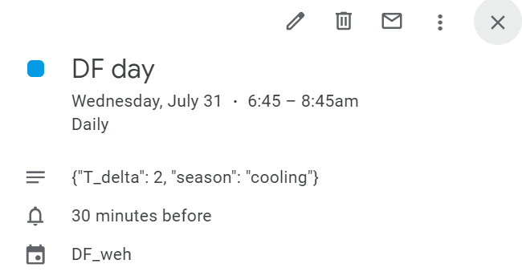

# The MA 01 house DF test automation uses the following entities

## Entities

### Calendar
- Using the Google calendar events to manage the start and end time of the DF events. This calendar entity is generarted from [google calendar HA integration](https://www.home-assistant.io/integrations/google/). The integration allows read and write events for a calendar attached with the google acct the HA server is authorized to access. 

Follow the google calendar integration documentation to set up the integration.

#### For DF event specific directions: 
    - only eable the calendar entity you want to use for the DF event, disable the rest. 
    - the google calendar event should have a description in a JSON string format with keys - t_delta and season for the DF automation to set appropriate offsets. 

 - calendar.df_weh
    
#### Google caledar example DF event  

#### Google caledar example HA entity

### Climate
- climate.thermostat

### Input Texts
- input_boolean.set_df_conditions
- input_text.thermostat_snapshot_fan_mode
- input_text.thermostat_snapshot_hvac_mode
- input_text.thermostat_snapshot_preset_mode
- input_text.thermostat_snapshot_hvac_action
- input_text.thermostat_snapshot_target_temp_low
- input_text.thermostat_snapshot_target_temp_high
- input_text.thermostat_snapshot_temperature

### Input Booleans
- input_boolean.df_event_status
- input_boolean.climate_snapshot
- input_boolean.set_point_changed_on_device
- input_boolean.df_restriction_status
- input_boolean.df_conditions_set
- input_boolean.thermostat_set_point_changed_on_device